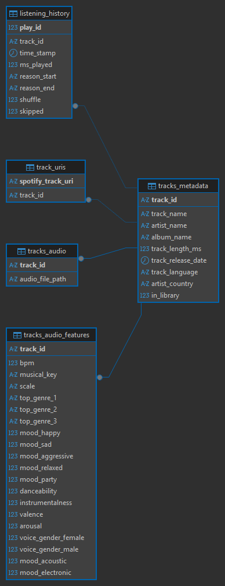

# Spotify-Noted

## Overview

Spotify Noted is an end-to-end data analytics project that processes Spotify data, stores it in MySQL, and generates dashboards and music library clusters.

**Status:** Active Development

### Features

- Import Spotify Extended Streaming History JSON files to analyse listening trends
- Import Spotify Account Data (Your Library) to identify saved songs from your library
- Load and store processed data in a MySQL database for efficient querying and management

### Planned Features

- Generate a dashboard displaying key listening statistics and trends
- Perform song clustering on the user's saved songs (from their library) using machine learning techniques to identify groups of similar music

## Setup

### Create Environment

```
git clone https://github.com/jiingjing/Spotify-Noted.git
cd Spotify-Noted
python -m venv .venv

source .venv/bin/activate             # Linux/masOS:
.venv\Scripts\activate                # Windows

pip install -r requirements.txt
```

### Request Spotify Data

1. Open the Privacy page on the Spotify website: https://www.spotify.com/uk/account/privacy/
2. Go to the "Download your data" section
3. Tick both the "Extended streaming history" and "Account data" boxes and submit your request
4. Confirm the request in your email
5. Download the .zip files when they arrive
6. Extract the folders into the project e.g. under `Spotify-Noted/raw_data/spotify`

### Create MySQL database and tables

For example, using DBeaver as your database management tool, run `schema.sql`.
Your database should look like:



### Configure a .env file

Using the `.env.example` as a template, edit it as needed.

## Usage

### 1. Load Spotify Extended Streaming History Data into database

```
python load_spotify.py
```

### 2. Fetch audio

```
python fetch_audio.py
```

Runs pipeline that tries to download `.mp3` audio files, with 3 parts:

1. spotDL (using Spotify song url)
2. spotDL retry (using Spotify song url)
3. yt-dlp (using song name and artist)

Note: Manual inspection shows that most tracks are downloaded correctly. However, some tracks download an incorrect version (e.g. a live recording instead of the expected studio version), and some tracks are not available on YouTube or YouTube Music.

#### Example Output

```
>>> python load_spotify.py
Loaded 248251 total audio events
246425 track events after filtering
Loaded 1686 tracks from library
Report written to logs\import_report.txt

Inserted 10820 unique tracks into tracks_metadata
Inserted 11787 URIs into track_uris
Import complete.

>>> python fetch_audio.py
Stage 1: spotDL
Found 1626 library tracks missing audio
Stage 1 done - 1420 saved, 206 missing
Errors written to logs\spotdl_errors.txt

Stage 2: spotDL retry
Found 206 tracks still missing
Stage 2 done - 28 saved, 178 missing
Errors written to logs\spotdl_errors.txt

Stage 3: yt-dlp fallback
Found 178 tracks still missing
Stage 3 done - 176 saved, 2 missing
Errors written to logs\ytdlp_errors.txt

Complete. 2 tracks still missing audio.
```
